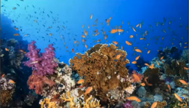
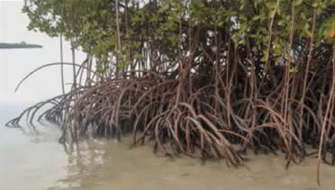

# 1.3 Aquatic Biomes

Type: Ecosystems

Aquatic biomes includes both freshwater and saltwater

How aquatic [[biomes]] are characterized

- Freshwater
    - Ponds vs. lakes (size)

        

    - Streams vs. rivers (size and wave action)

        

    - Wetlands (vegetation):
        - Marshes (non woody)

            

        - Swamps (wooded)

            

        - Bogs (acidic, peat)

            

**[[Abiotic]] conditions:**

1. Depth
2. Light penetration (deeper = less light)
3. Temperature (varies by depth)
4. Velocity (currents)
5. Salinity
6. Dissolved Oxygen levels
7. Nutrients (nitrates and phosphates) – limiting resource
8. Bottom substrate (muddy or sandy or rocky)

**Freshwater stratification:**

**Littoral Zone**: More plant life and light

**Benthic Zone**: Nutrients (settle off bottom)

**Photic Zone**: Where light can penetrate to

**Profundal Zone**: No light in this zone

Marine:

- Intertidal (area between the tides)

    

- Coral Reefs – warm, shallow water

    

- Open ocean – far from continent
- Estuaries
- Marshes (non-wooded)

    

- Swamps (wooded)

Marshes, swamps, coral reefs, and estuaries have the highest productivity and biodiversity.

**Saltwater stratification**:

**Intertidal zone**: Coast

**Benthic zone**: Nutrients settle here

**Upwelling**: Where there is turnover between water in lower ocean and higher ocean – nutrients are brought up for phytoplankton