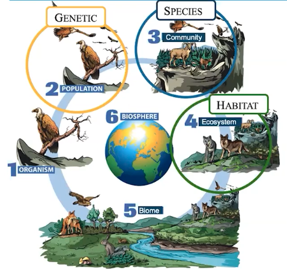

# 2.1 Introduction to Biodiversity

Type: Biodiversity

**Genetic diversity**: DNA, not visible from outside usually

**Species diversity**: Count number of species (Visible)

**Habitat diversity**: How the habitat changes (salinity, tide)

How do we compare biodiversity?

- Number of species present (**Species** **richness**)
- Relative abundance of species (**species evenness**)

High primary productivity = high biodiversity

Nature selects for certain favorable traits, and against other unfavorable traits (**natural selection**).

If the gene pool decreases, you go through a population bottleneck. Population bottlenecks can cause inbreeding.

Examples of selective pressures:

- Predators (bright color leads to increased predation) – biotic factor
- Water temperature, salinity – abiotic factors

- Greater **genetic** diversity = better response to environmental stressors
- Loss of **habitat** harms specialists first, and then the generalists.
- Ecosystems with more **species** better recover from disturbance

Specialists have a harder time adapting to disturbance compared to generalists.

**Higher biodiversity**: 

- Some variation in the environment
- Evolution
- Minor disturbances (surface fires)
- High habitat diversity

**Lower biodiversity:**

- continuous environmental stress
- extinction
- extreme disturbances (hurricanes, crown fires, clear cutting)
- geographic isolation
- invasive species