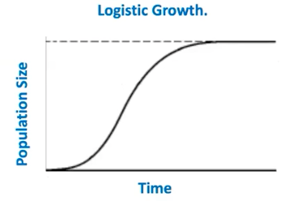

# 3.5 Population Growth and Resource Availability
**Environmental resistance**: Factors that limit growth

**Density Dependent** resistance factors:
- tend to be biotic
- have strong influence when organisms per unit area reach certain level
- competition for resources
- predation
- parasitism/disease

**Density independent** resistance factors:
- tend to be abiotic
- have effect on all populations, regardless of size or density
- i.e. natural disasters, sever weather, drought 

**Exponential** growth (**unlimited** resources):

**Logistic** growth (**limited** resources):
